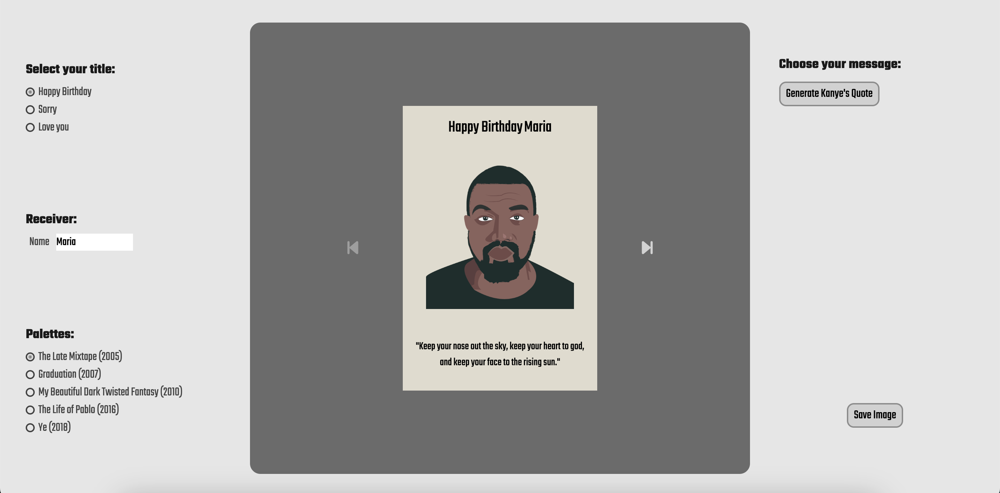

# Kanye Said

Kanye Said is a web application that allows users to create and customize cards for their loved ones, featuring iconic Kanye West quotes.



## Features  

With **Kanye Said**, you can:  

- **Generate personalized messages** for your loved ones.  
- **Customize your cards** with designs inspired by Kanye West's legendary albums.  
- **Incorporate iconic Kanye West quotes** into your creations.  
- **Select different card formats** to suit your style.  
- **Save your masterpiece** as a JPEG image and share it with ease. 

## Installation

Follow these steps to install and run the project locally:  

1. Clone the repository:  
   ```bash
   git clone https://github.com/LorenaSTN/kanye-said.git

2. Navigate to the project directory:
    ```bash
    cd kanye-said

3. Install the dependencies:
    ```bash
    npm install

4. Run the project:
    ```bash  
    npm run dev

## Technologies Used  

This project was built using the following technologies:  

- **HTML5**  
- **SASS**  
- **JavaScript** 


## Credits 

Lorena Sánchez-Toril
[Linkedin](https://www.linkedin.com/in/lorena-sancheztoril/)
